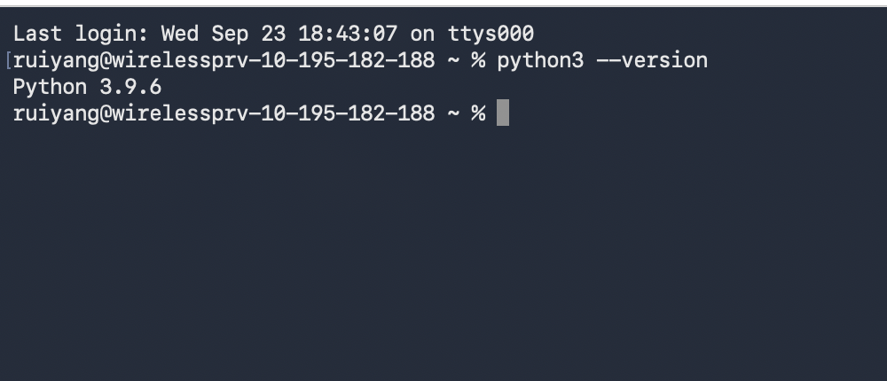
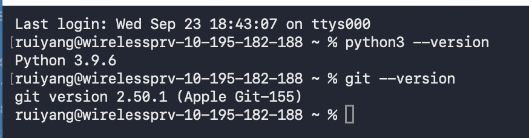
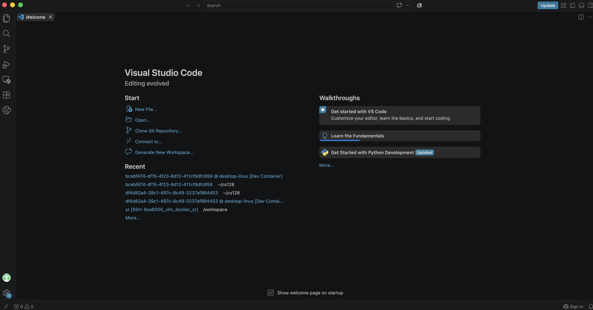

# Init IS310 Homework

## Proof of Installation

1. Python

2. Git

3. VS Code

4. Hypothesis Username

My Hypothesis username is: `RuiiiYang`

5. AI Tool/Workflow

I plan to use ChatGPT as my main AI tool this semester. I will use it to help me understand course concepts, troubleshoot code, brainstorm ideas, and improve my workflow when working on assignments and projects. I will also document my use of AI when required and make sure that I understand and can explain the work I submit.
